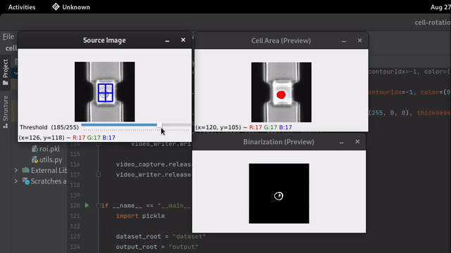
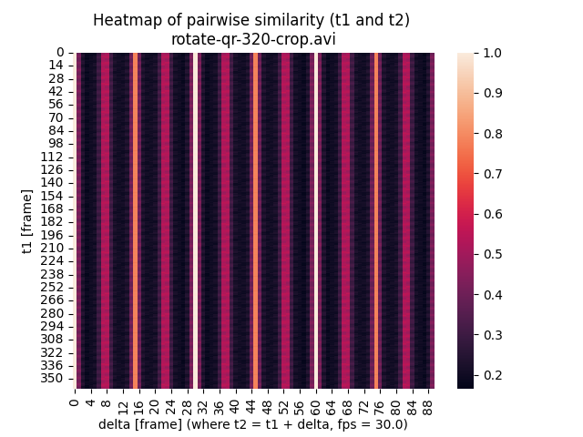

# Cell Rotation
Python script to calculate the rotation speed of the cell from cell videos.

## Dependency
```
python3
pip install tqdm seaborn scikit-learn scipy Pillow pandas opencv-python opencv-contrib-python numpy matplotlib
```

## Usage
0. Get your system ready for the mentioned dependencies.
1. Clone this repo.
2. Inside the script directory, create a new directory named `dataset`.
3. Copy the cell videos to analyze into the `dataset` directory.
4. Execute the main script, `python main.py`.

## Start analyzing
1. **Select ROI for analyzing**  
The selection will be cached into python pickle file named `roi.pkl`, so that you wouldn't need to select the ROI again next time for the same video. Press ENTER to proceed.
2. **Adjust the threshold for the binarization**  
The optimal threshold gives the most accurate cell area. Press ENTER to proceed.
   
3. The processing will be started. The result will be outputted the directory named `output`.

## Output
The output result is a heatmap of pairwise similarity of frame `t1` and frame `t2`. For example,



From this figure, we can observe some peaks in pairwise similarity at `delta=30` and `delta=60`. These peaks indicate the rotation cycles. Given that the rotation cycle is `30 (frames)`, fps is `30.0`, we can calculate that the rotation speed is `360 (deg/s)`.